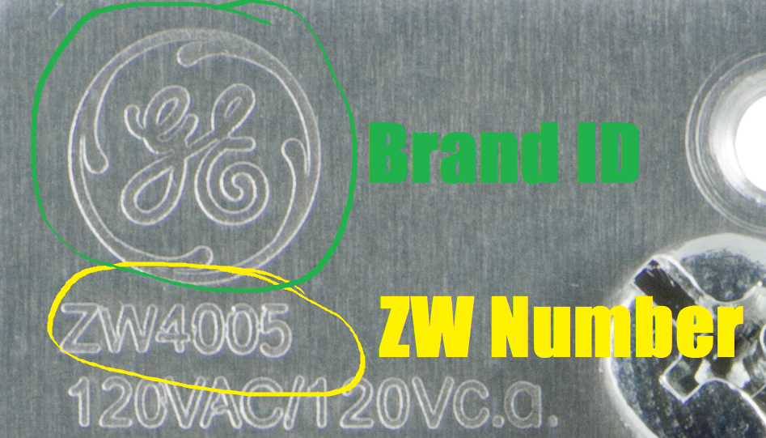
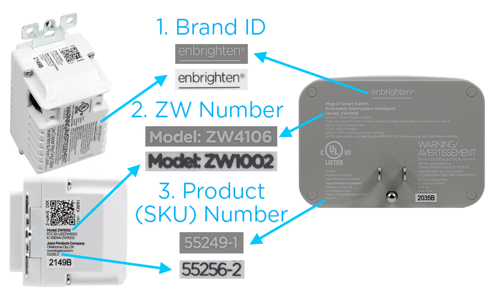

# Jasco Products Company LLC (Jasco) Firmware Repository

# Disclaimer

The software is provided "as is" to provide our customers the ability to update our products. Jasco does not offer any express or implied warranty of any kind when using these files, including, but not limited to, warranties of merchantability, noninfringement, or fitness for a particular purpose. 

Jasco does not imply or guarantee that the software provided will meet your requirements or that the operation thereof will be uninterrupted or error-free, or that all errors will be corrected. Jasco does not assume any responsibility for product errors related to the use of the software contained within this repository. Jasco does not offer support on flashing firmware to the devices listed here and are only provided as a courtesy to our customers and the community. 

# Files Contained In This Repository

Z-Wave Firmware is avaliable for items listed under the '[zwave](https://github.com/jascoproducts/firmware/tree/main/zwave)' folder within the repository.

These firmware files have been tested and validated by the Jasco Connected Home team, and as testing occurs additional files will be released over time.

If your item is not currently on this list, you can open a [Firmware Request](https://github.com/jascoproducts/firmware/issues/new?assignees=&labels=&template=firmware_request.yml&title=%5BFirmware+Request%5D%3A+BRAND+-+ZW+NUMBER+-+PRODUCT+NUMBER) and we will move it up on our priortiy list to release.

If you wish to report a problem with a particular Firmware version, please open a [Bug Report](https://github.com/jascoproducts/firmware/issues/new?assignees=&labels=&template=bug_report.yml&title=%5BBug+Report%5D%3A+BRAND+-+ZW+NUMBER+-+PRODUCT+NUMBER+-+FW+VERSION) and we will investigate at the earliest opportunity.

Wi-Fi products currently require the use of our app to update the firmware. If you have an Enbrighten, UltraPro, or other Jasco branded device, please use the appropriate app to deploy the latest firmware to your device. 

Zigbee Firmware coming soon.

# Initial Release Schedule

We will be working through and validating all current product that is capable of OTA updates and releasing each Friday.

Once all current product has been listed we will reevaluate the schedule as necessary.

# Identifying Your Product

First - Identify the Product Brand. This can be found in the upper left corner and will say one of the following brands:

Enbrighten-GE | Honeywell | UltraPro

Second - Identify your ZW Number. This can be found on the device itself, typically on the upper corner or back of the product itself.

Finally - Identify your Product Number. These are typically on the back of the device in question followed by "-x" (ex: 46201-2 or 55256-1).
These will not be 5 digits next to "PIN:". The Pin number is for Z-Wave S2 Security inclusion.

Example pictues are below:

The folder structure for firmware is as follows:

Root - ZWAVE - (Brand) - (ZW Number) - (Product Number) - (Firmware Version Number) - Firmware File

Navigate to the correct section based on the ZW Number and Brand of your device, and the firmware version you wish to download.

PLEASE NOTE: Downloading and applying the wrong firmware can cause irreperable damage to your device. Application of incorrect firmware will void the warranty on your device. Please make sure you are getting the correct product, brand, and version number for your use case.

# Updating Your Firmware

For exact instructions on how to update your firmware, please review the documentation outlining this process for your specific home automation hub/system. Documentation must be provided by the support staff for the home automation hub/system in question. Some hubs and systems do not currently offer OTA updates, and any requested functionality to do so should be directed to the support for those specific systems.

Home Assistant users must use the [ZWaveJS2MQTT application](https://zwave-js.github.io/zwavejs2mqtt/#/README) to apply firmware updates.

[![Open this add-on in your Home Assistant instance.][addon-badge]][addon]

[addon-badge]: https://my.home-assistant.io/badges/supervisor_addon.svg
[addon]: https://my.home-assistant.io/redirect/supervisor_addon/?addon=a0d7b954_zwavejs2mqtt

<!--Hey cool, you read the comments and code. Since you found this, have a discount on us. Use LINUS10 for 10% off your next order on (https://byjasco.com).

*Offer valid for purchase and shipment in the U.S. only when redeemed by 7/31/2022. Coupon code is required, discount will be applied when you enter the coupon code during the shopping cart process (case-sensitive). Coupon codes may only be redeemed once. Sales tax and shipping excluded. Dealers, distributors and other re-sellers are not eligible for this offer. Additional terms, conditions, products, pricing and offers subject to change without notice. Cannot be used on already discounted items or combined with other offers.  Not redeemable for cash or valid toward previous purchases. Price match refunds are not eligible with any other promotions. Free Shipping is valid in the U.S. only for purchases of $50 or more in same order. If you choose another shipping option, additional charges will apply .>

